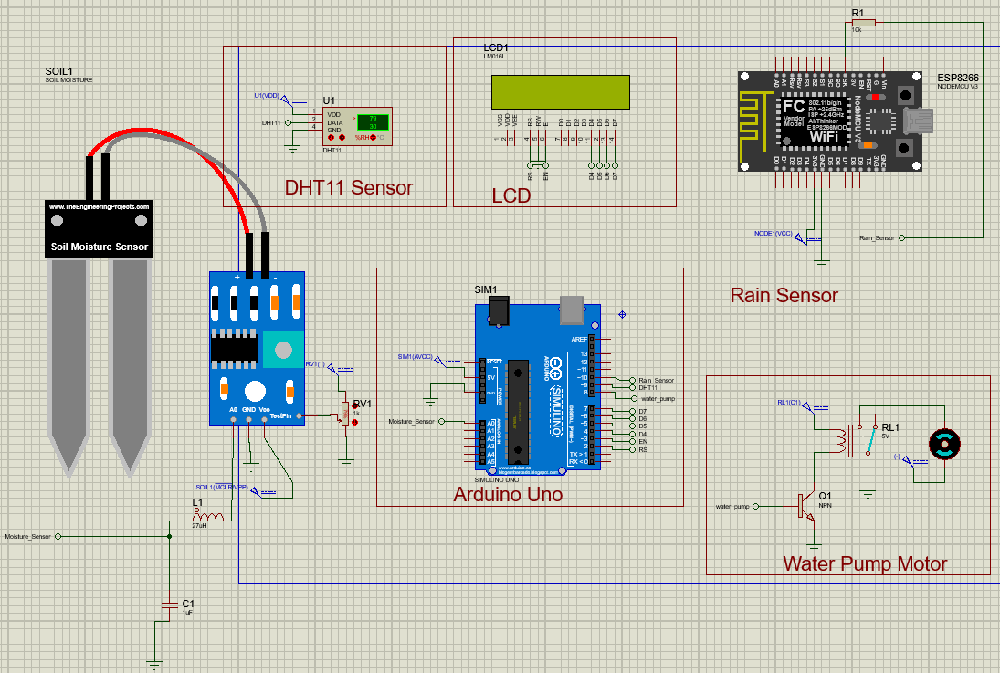

# Automatic Irrigation System
## Description
A smart irrigation system designed and simulated in Proteus using Arduino. The project automates irrigation based on soil moisture, temperature, and weather forecast data, aiming to optimize water usage and reduce manual effort.

## Features
- Real-time monitoring of soil moisture and temperature.
- Rain prediction integration using OpenWeatherMap API.
- Automated pump control based on environmental conditions.
- Simulation in Proteus with Arduino Uno and mock ESP8266.

## Technologies Used
- **Arduino Uno** for sensor management and control logic.
- **ESP8266** (mocked) for weather data simulation.
- **Proteus** for circuit design and simulation.
- **DHT11** sensor for temperature and humidity.
- **20x4 LCD** for system status display.


## Project Structure
### Code:
- **ESP8266_code.ino**: Handles weather forecast fetching and rain status simulation.
- **Arduino_code.ino**: Reads sensors and controls the relay for irrigation.

## Setup and Usage

1. Clone this repository:
   ```bash
   git clone https://github.com/Zahir-Seid/Automatic-Irrigation-System
   
2. Open the Proteus schematic file.
3. Load the HEX files for Arduino Uno and mock ESP.
4. Run the simulation and test various scenarios.

## Screenshots




## License
This project is open-source under the MIT License. Feel free to use and modify it for educational purposes.